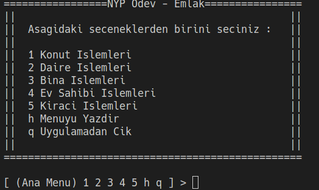
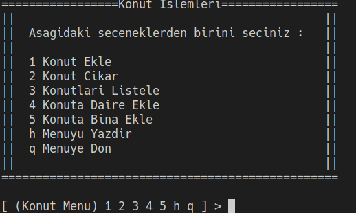
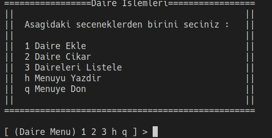
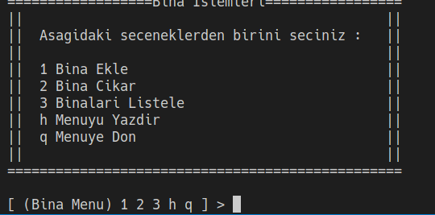
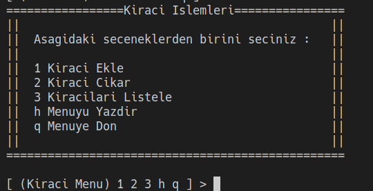
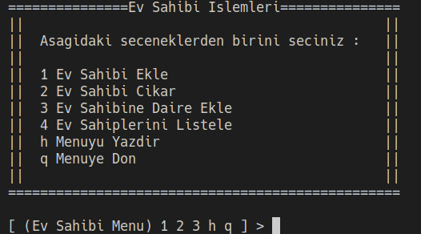

# Emlak Yonetim Sistemi

Basit bir emlak yonetim sistemi benzeri.

## Ozellikler

- Temel varlik yonetimi icin olusturulmus CLI.
- Her varliga ait birer menu arayuzu.
- Repository Patterndan faydalanilarak olusturulmus gecici depolama sistemi.

## Uygulamanin Calistirilmasi

```bash
$ git clone git@github.com:KLU1220505021/nyp-odev.git
$ cd nyp-odev/src && javac Main.java && java Main
```

## Resimler

### Ana Menu



---

### Varliklara Ait Alt Menuler

---



---



---



---



---


